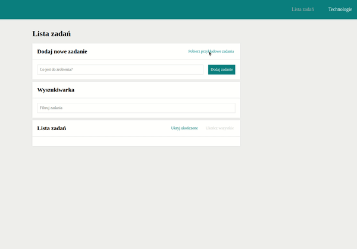

# To Do List with React

## Table of contents
* [Description](#description)
* [Overview](#overview)
* [Demo](#demo)
* [Technologies](#technologies)
* [Available Scripts](#available-scripts)

## Description

This project is the result of developing the <a href="https://github.com/olachrzan/to_do_list">previous version of to-do list</a>.

  
 
What you can do:

<ul>
  <li>
    <strong>Add new tasks</strong>
    
You can add new tasks and they will be displayed below. A great facilitation is that after saving a task, focus stays on the input, so you can enter several tasks in a row.

  </li>
  <li>
    <strong>Fetch example tasks</strong>
    
There is a button in the save section that fetch example tasks, so you can see how this app works without adding your own tasks.

  </li>
  <li>
    <strong>Actions on tasks</strong>
    
Saved tasks can be marked as done by clicking the green button (then they will be crossed out) or they can be deleted by clicking the red button. It's also possible to interact on several tasks at once - you can hide/show completed tasks or mark all tasks as done.

  </li>
  <li>
    <strong>Details of the task</strong>
    
If you want to see details of the task, click on its content - you will be redirected to the subpage of the task.

  </li>
  <li>
    <strong>Tasks search</strong>
    
Additionally, above the list of tasks there is a search engine - just start typing to find the task that you are interested in.

  </li>
  <li>
    <strong>Navigation</strong>
    
There is a navigation at the top, so you can switch between the task list and the page about technologies which used in the project.

  </li>
</ul>

This project was bootstrapped with <a href="https://github.com/facebook/create-react-app">Create React App</a>

## Overview

## Demo

You can find the demo [here](https://palarczykenterprises.com/todo_list_react/#/zadania)

## Technologies

Project is created with:

- HTML
- CSS (Grid, Flex, media queries)
- JavaScript (ES6+)
- Promise, async / await
- Create React App
- React Hooks
- React Router
- Styled Components
- Redux
- Redux-Saga

## Available Scripts

In the project directory, you can run:

### `npm start`

Runs the app in the development mode.\
Open [http://localhost:3000](http://localhost:3000) to view it in your browser.

The page will reload when you make changes.\
You may also see any lint errors in the console.

### `npm test`

Launches the test runner in the interactive watch mode.\
See the section about [running tests](https://facebook.github.io/create-react-app/docs/running-tests) for more information.

### `npm run build`

Builds the app for production to the `build` folder.\
It correctly bundles React in production mode and optimizes the build for the best performance.

The build is minified and the filenames include the hashes.\
Your app is ready to be deployed!

See the section about [deployment](https://facebook.github.io/create-react-app/docs/deployment) for more information.

### `npm run eject`

**Note: this is a one-way operation. Once you `eject`, you can't go back!**

If you aren't satisfied with the build tool and configuration choices, you can `eject` at any time. This command will remove the single build dependency from your project.

Instead, it will copy all the configuration files and the transitive dependencies (webpack, Babel, ESLint, etc) right into your project so you have full control over them. All of the commands except `eject` will still work, but they will point to the copied scripts so you can tweak them. At this point you're on your own.

You don't have to ever use `eject`. The curated feature set is suitable for small and middle deployments, and you shouldn't feel obligated to use this feature. However we understand that this tool wouldn't be useful if you couldn't customize it when you are ready for it.